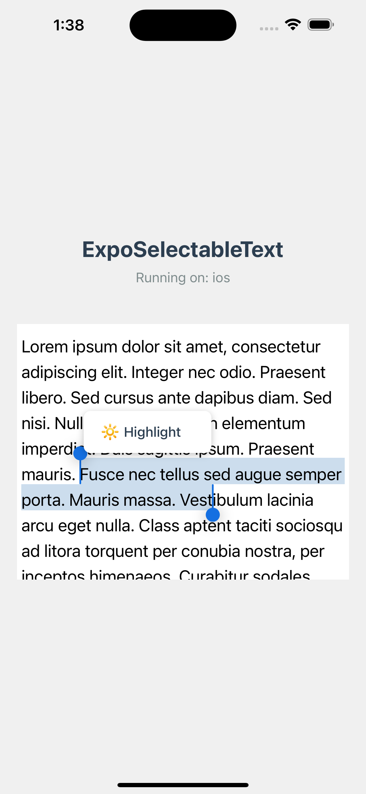

# Expo Selectable Text

ExpoSelectableText is a custom React Native component that provides text selection functionality for both Android and iOS.

# Installating the library
  
```
npm install @stonega/expo-selectable-text
```
    

#### Android and iOS


<!-- TODO: Add iOS screenshot -->

#### Examples

```tsx
import { ExpoSelectableTextView } from "expo-selectable-text";
import { Platform } from 'react-native';

  <ExpoSelectableTextView
    ref={textViewRef}
    style={styles.selectableTextView}
    onSelectionEnd={handleSelectionEnd}
    onSelecting={() => {
      console.log(Date.now(), "Selecting fired");
      setShowPopup(false);
    }}
    fontSize={20}
    lineHeight={30}
    fontFamily={"Jersey-Regular"}
    text="Lorem ipsum dolor sit amet, consectetur adipiscing elit. Integer nec odio. Praesent libero. Sed cursus ante dapibus diam. Sed nisi. Nulla quis sem at nibh elementum imperdiet. Duis sagittis ipsum. Praesent mauris. Fusce nec tellus sed augue semper porta. Mauris massa. Vestibulum lacinia arcu eget nulla. Class aptent taciti sociosqu ad litora torquent per conubia nostra, per inceptos himenaeos. Curabitur sodales ligula in libero. Sed dignissim lacinia nunc. Proin ut ligula vel nunc egestas porttitor. Morbi lectus risus, iaculis vel, suscipit quis, luctus non, massa. Fusce ac turpis quis ligula lacinia aliquet. Mauris ipsum. Nulla metus metus, ullamcorper vel, tincidunt sed, euismod in, nibh."
  />
```

Using FlatList:

```tsx
<FlatList
        data={[1, 2, 3, 4, 6]}
        // You need to use this prop to avoid clipping the text
        removeClippedSubviews={false}
        renderItem={() => (
          <ExpoSelectableTextView
            style={{ height: 400 }}
            onSelectionEnd={(event) => alert(JSON.stringify(event.nativeEvent))}
            fontSize={18}
            text="Lorem ipsum dolor sit amet, consectetur adipiscing elit. Integer nec odio. Praesent libero. Sed cursus ante dapibus diam. Sed nisi. Nulla quis sem at nibh elementum imperdiet. Duis sagittis ipsum. Praesent mauris. Fusce nec tellus sed augue semper porta. Mauris massa."
          />
        )}
      />
```   

To use a custom font family, you must configure it with Expo Fonts.

```
npx expo install expo-font
```

```
{
  "expo": {
    "plugins": [
      [
        "expo-font",
        {
          "fonts": ["./assets/fonts/Inter-Black.otf"]
        }
      ]
    ]
  }
}
```

```
  <ExpoSelectableText
  ...
  fontFamily={"Inter-Black"}
  />
```


# Contributing

Contributions are very welcome! 
